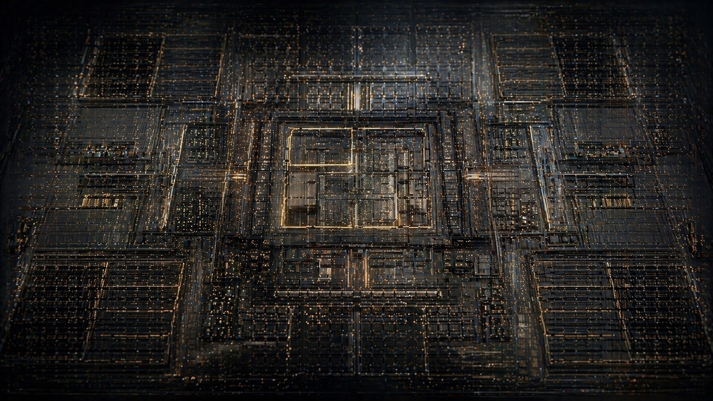

# Axiom

> **From electrons to execution.**
> A visual encyclopedia of computer architecture.

Axiom makes the invisible silicon visible. Every concept lives on the die where it actually runs — registers, opcodes, caches, pipelines, branch predictors, coherence protocols, accelerators — explained with rigorous writing and rendered as a live chip die-shot you can read like a map.

The site is a static React app, hostable on GitHub Pages. No backend, no SSR, no data store — just a chip that looks alive.



---

## Live experience

The background isn't decoration — it's a working model of the memory hierarchy. At any moment up to nine **memory transactions** are in flight on the chip:

- A random memory cell glows (`row × column` hit at a bank)
- An electron leaves the cell and walks the bus hierarchy: HBM → cache column → mixed column → light shaft → focal/CPU
- Each bridge lane lights as the electron enters it (rise → hold → fade)
- On arrival the focal stack ripples through the cache layers in order: **L3 → L2 → L1 → TLB → register file**
- ~30% of reads spawn a follow-up store; ~10% of writes spawn a follow-up read (write-allocate / dirty eviction)

Four colors map to real bus channels:

| Color | Channel |
|---|---|
| 🟡 Yellow | Data payload |
| 🔵 Blue | Address / control |
| 🟢 Green | Ack / coherence reply |
| 🔴 Red | Coherence / writeback (rare) |

The intensity adapts to context: full traffic on the homepage, calmer on the index, a slow trickle on long-form concept pages so prose never has to fight the chip.

---

## Quick start

```bash
npm install
npm run dev      # vite dev server at http://localhost:5173
npm run build    # production build to dist/
npm run preview  # preview the production build
```

No environment variables, no auth, no API keys.

---

## Stack

- **Vite + React 18** — static SPA
- **React Router** — `/`, `/index`, `/d/:domain`, `/c/:slug`
- **Tailwind CSS** — utility styles + a small set of theme tokens in `globals.css`
- **Framer Motion** — page entry animations + flip cards
- **Fuse.js** — fuzzy search across concepts and domains
- **Lucide** — icons
- **Canvas 2D** — the live die-shot background; SVG for floorplan + visualizers

GitHub Pages compatible. Single-page app, hash-free routing, no SSR.

---

## Project structure

```
src/
├── app/
│   ├── App.jsx                # routes + layout shell
│   └── theme.jsx              # dark/light theme provider
├── components/
│   ├── background/
│   │   └── CircuitFlow.jsx    # the live die-shot canvas
│   ├── shell/
│   │   ├── Navbar.jsx         # thin glass instrument panel
│   │   ├── ThemeToggle.jsx    # icon-only sun/moon
│   │   ├── SearchPalette.jsx  # ⌘K search modal
│   │   └── Wordmark.jsx       # 3D logo glyph
│   └── atlas/
│       ├── DieHero.jsx        # the focal chip floorplan (10 blocks)
│       └── MobileBlocks.jsx   # mobile fallback for the floorplan
├── concepts/                  # one folder per concept
│   ├── isa/                   # what-is-an-isa: meta + content + visualizer
│   ├── cpu-pipeline/
│   ├── cache-hierarchy/
│   └── index.js               # registry
├── data/
│   └── domains.js             # the 10 atlas domains + die floorplan
├── pages/
│   ├── Atlas.jsx              # /
│   ├── IndexPage.jsx          # /index
│   ├── DomainPage.jsx         # /d/:domain
│   └── ConceptPage.jsx        # /c/:slug
└── styles/
    └── globals.css            # design tokens, .display, .lede, etc.

public/
├── favicon.svg                # 3D chip-stack favicon
├── og-image.jpg               # cinematic 1200×630 share card
└── og-image.svg               # SVG fallback share card
```

---

## Adding a concept

A concept is a folder under `src/concepts/<slug>/` with three files:

```
src/concepts/<slug>/
├── meta.js          # id, title, domain, layers, difficulty, related, ...
├── content.js       # intuition, problem, mechanism, tradeoffs, lineages
└── visualizer.jsx   # the interactive figure
```

Then register it in `src/concepts/index.js`. The atlas, search index, and concept page route pick it up automatically.

Every concept must answer:

1. What problem does it solve?
2. What's the mechanism?
3. What are the latency / bandwidth / power / area / energy / security / complexity trade-offs?
4. Where do ARM, x86, and RISC-V differ?
5. What are the software, compiler, and OS implications?

---

## Design system at a glance

- **Identity:** black silicon + etched lithography + flowing signals + liquid glass UI
- **Default theme:** dark (light is opt-in via the toggle; system preference is intentionally ignored)
- **Substrate:** near-black graphite, not pure black
- **Primary accents:** restrained cyan (signal) + warm amber (focal core) + green/red as rare statuses
- **Type:** Fraunces (display, italic for emphasis) + Inter (body) + JetBrains Mono (markers / kbd)
- **Animations must teach.** Decorative motion is a bug. `prefers-reduced-motion` paints a single static frame.
- **Cursor light:** a soft warm halo follows the pointer; nearby memory cells twinkle in bus-channel colors. Works on every page.

Three intensity tiers driven by route in `App.jsx`:

| Route | Density | Spawn | Concurrent | Brightness |
|---|---|---|---|---|
| `/` | 1.4 | 320 ms | 9 | 100% |
| `/index`, `/d/*` | 0.7 | 320 ms | 9 | 32% |
| `/c/*` | 0.30 | 2200 ms | 2 | 18% |

---

## Scripts

| Script | What it does |
|---|---|
| `npm run dev` | Vite dev server with HMR |
| `npm run build` | Production build to `dist/` |
| `npm run preview` | Serve the production build locally |

---

## Contact

Maintained by **ElevenDots**.
For questions, ideas, or partnership: **[overclocked@elevendots.ai](mailto:overclocked@elevendots.ai)**

---

## License

All rights reserved © ElevenDots.
